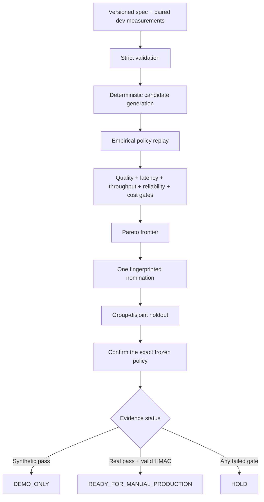

# TASC

**Trace-Aware Serving Controller**

TASC is an offline inference-policy lab for deciding when a fast serving profile
can handle routine requests and when an expert profile should take over. It
replays paired measurements, searches only a preregistered policy space, freezes
one development nominee, and confirms that exact policy on a group-disjoint
holdout.

The result is an evidence packet—not a deployment. Cost or latency improvements
never compensate for a failed quality, reliability, throughput, or tail-latency
gate.

## Why this exists

Inference optimization is a coupled product decision:

| Question | TASC evidence |
| --- | --- |
| Is the fast path good enough? | Paired task scores and critical-slice gates |
| Does routing actually save money? | Measured serial-attempt cost, not model-size estimates |
| Will users feel the difference? | P95 TTFT, P95/P99 end-to-end latency, and perceived TPS |
| Will the service scale? | Total TPS, concurrency metadata, failures, and traffic weights |
| Did we overfit the benchmark? | Development selection followed by exact-policy holdout confirmation |
| Can the artifact be trusted? | Stable fingerprints plus optional HMAC attestation |

TASC never calls a model provider, predicts unmeasured GPU performance, changes
an endpoint, or deploys a configuration.

## Quickstart

Requirements: Node.js 22 or newer.

```bash
git clone git@github.com:rachittshah/tasc.git
cd tasc
npm ci
npm run demo
```

Expected output:

```text
NOMINATED — artifacts: /tmp/tasc-demo-.../development
DEMO_ONLY — artifacts: /tmp/tasc-demo-.../holdout
Synthetic artifacts: /tmp/tasc-demo-...
```

The bundled measurements are fictional. Even when every gate passes, synthetic
evidence is permanently labeled `DEMO_ONLY`.

## Decision flow



`nominate` is the only selection step. `confirm` cannot search the holdout for a
better threshold.

## Run the commands directly

```bash
TASC_RUN_ROOT=$(mktemp -d)

npm run tasc -- nominate \
  --spec examples/synthetic/spec.json \
  --measurements examples/synthetic/dev.json \
  --out "$TASC_RUN_ROOT/development"

npm run tasc -- confirm \
  --spec examples/synthetic/spec.json \
  --measurements examples/synthetic/holdout.json \
  --nomination "$TASC_RUN_ROOT/development/nomination.json" \
  --out "$TASC_RUN_ROOT/holdout"
```

Output directories must be new. TASC refuses to overwrite or blend evidence
from different runs.

## What gets evaluated

Each policy is replayed from measurements for both the fast and expert serving
profiles. A cascade escalates when:

- the fast attempt fails;
- routing confidence is absent or below the candidate threshold;
- input length reaches the candidate threshold; or
- a configured critical slice matches.

Escalation is conservatively modeled as serial execution: the result includes
both attempts' measured cost and elapsed time. TASC does not invent a
direct-to-expert counterfactual that was never benchmarked.

Independent gates cover:

- mean and critical-slice task quality;
- paired bootstrap non-inferiority against the expert champion;
- P95 time to first token and end-to-end latency;
- P10 perceived and P50 total tokens per second;
- error rate;
- cost per thousand requests; and
- minimum development cost improvement.

Rejected policies and their failed gates remain in the report.

## Status contract

| Status | Meaning |
| --- | --- |
| `NOMINATED` | A development candidate passed every gate and won deterministic selection. |
| `NO_CANDIDATE` | No development candidate passed all gates. |
| `DEMO_ONLY` | Holdout passed, but development or holdout evidence is synthetic. |
| `HOLD` | Holdout failed, or real evidence lacks a verified nomination attestation. |
| `READY_FOR_MANUAL_PRODUCTION` | Real evidence passed and its HMAC verified; a human rollout decision is still required. |

No status changes production.

## Real measurements

Real use requires paired outcomes for every profile and case, including
timeouts, OOMs, provider failures, and their incurred cost. Split related
examples by `groupId`, freeze evaluator and policy-space versions, and preserve
arrival pattern, concurrency, cache, and network boundaries.

For authenticated real-data continuity, load the same secret for nomination and
confirmation:

```bash
export TASC_ATTESTATION_KEY="<at least 32 UTF-8 bytes from your secret manager>"
```

The key is environment-only and is never written to artifacts. HMAC proves
nomination continuity, not benchmark truth; dataset custody, evaluator
validation, and operational review remain human responsibilities.

## Repository map

```text
src/
  schema.ts       versioned contracts and semantic validation
  policy.ts       deterministic candidates and empirical replay
  evaluate.ts     metrics, gates, Pareto selection, and confirmation
  report.ts       reviewer artifacts and next-experiment diagnostics
  cli.ts          nominate / confirm adapter
examples/
  synthetic/      fictional dev and holdout workflow
tests/             55 contract, replay, tamper, split, report, and CLI checks
docs/
  design.md
  operating-guide.md
```

## Development

```bash
npm run typecheck
npm test
npm run build
npm run demo
npm pack --dry-run
```

Read the [operating guide](docs/operating-guide.md) for measurement semantics
and trust boundaries, or the [design document](docs/design.md) for the decision
architecture.

## Author

Built by [Rachitt Shah](https://github.com/rachittshah).

Released under the [MIT License](LICENSE).
